# TP 2

- **Nombre**: Emanuel Rodriguez Bedeman

- `student_id`: emanuel_rb

Captura del DAG:

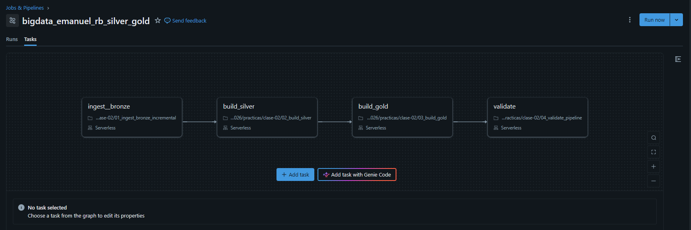

Nombre del DAG: `bigdata_emanuel_rb_silver_gold` [[Link](https://dbc-24f5f7d1-6af3.cloud.databricks.com/jobs/640878803672900/tasks?o=7474656188603317)]

## Resultados de la primera ejecución.

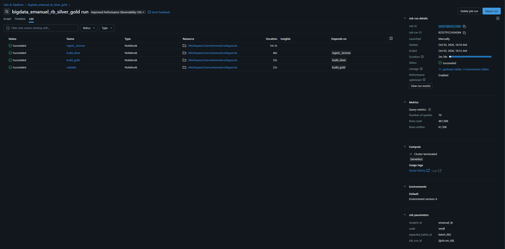

## Resultados de la segunda ejecución.


## Cantidades aceptadas y rechazadas para batch_002.


## Explicación breve de por qué COPY INTO y MERGE resuelven problemas diferentes.

`COPY INTO` trabaja a nivel de archivo. Registra qué archivos ya fueron ingeridos y, en una corrida posterior, solo lee los que todavía no están en ese registro. Las filas de un archivo nuevo se agregan. No compara registros ni modifica filas que ya estaban en la tabla. Resuelve la ingesta repetida: un archivo ya cargado no vuelve a insertarse.

`MERGE` trabaja a nivel de fila. Compara la tabla destino con un conjunto de filas nuevas usando una clave. Si la clave ya existe y se cumple la condición de actualización, reemplaza esa fila. Si no existe, la inserta. Si existe y la condición no se cumple, la deja como está. No mira de qué archivo vino el dato. Resuelve la vigencia de cada clave: el registro se actualiza en la misma fila o se agrega si todavía no estaba, sin dejar dos versiones.

El primero evita reprocesar archivos. El segundo mantiene una sola versión vigente de cada registro.

## Las cuatro visualizaciones y una respuesta explícita para cada pregunta.

### **Pregunta 1**: ¿Qué día tuvo el mayor monto vendido y ese día también fue el de mayor cantidad de transacciones?

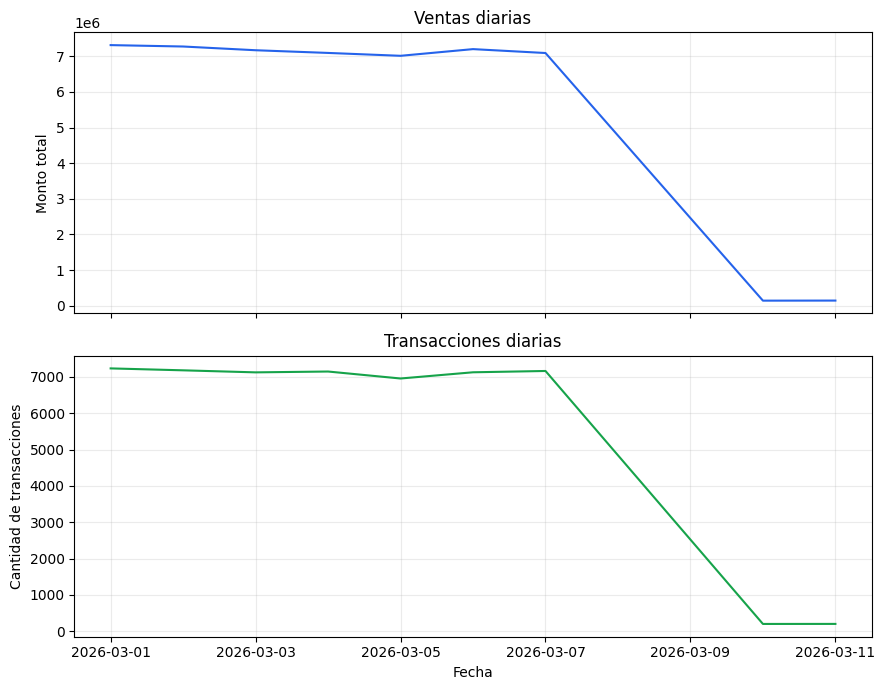

**Respuesta:** Fecha con mayor monto vendido: 2026-03-01  (Monto: 7,310,840.77, Transacciones: 7,236)

Fecha con mayor cantidad de transacciones: 2026-03-01  (Monto: 7,310,840.77, Transacciones: 7,236)

¿Coinciden? Sí.

Conclusión: Ambos máximos cayeron el 2026-03-01, con un ticket promedio de $1,010.34, comparado con $1,000.17 en el resto de los días. Ese día combinó alto volumen y tickets elevados.

### **Pregunta 2**: ¿Qué canal de pago presenta la mayor tasa de fraude? ¿La conclusión se sostiene al considerar el número de transacciones de cada canal?

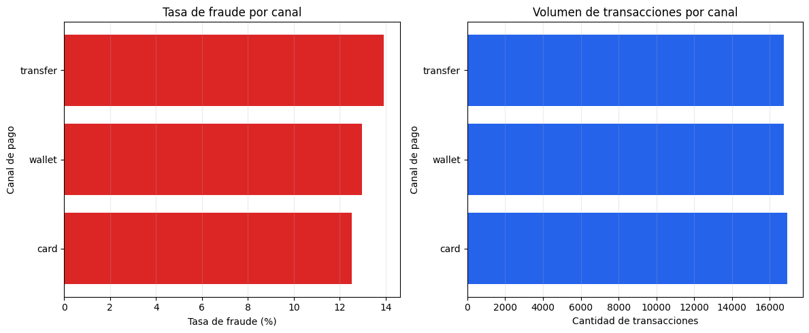

**Respuesta:** Respuesta: transfer es el canal con mayor tasa de fraude (13.91%).

Ese canal procesó 16,723 transacciones (33.2% del total 50,349).
La tasa global de fraude es 13.14%.

Conclusión: transfer no sólo tiene la mayor tasa de fraude sino también un volumen representativo
(33.2% del total), por lo que la conclusión se sostiene al considerar el número de transacciones.

### **Pregunta 3**: ¿Qué combinación de país y categoría genera el mayor monto? ¿Existe una categoría dominante en todos los países o cambia según el mercado?

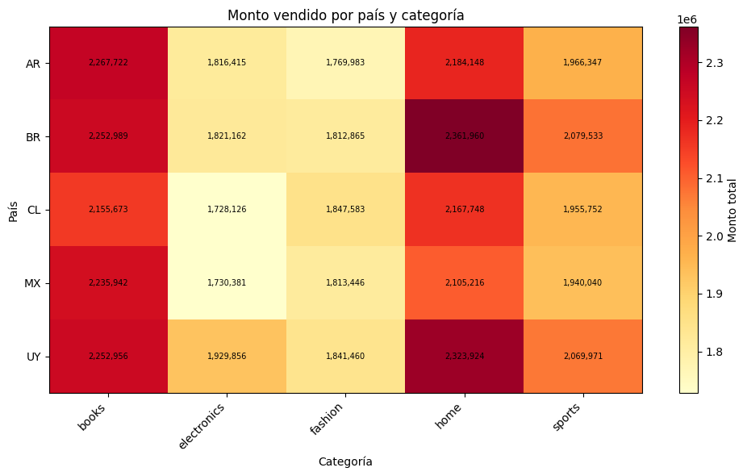

**Respuesta:** Respuesta: *BR + home* es la combinación con mayor monto vendido (`2,361,959.97`).

Categoría dominante por país:
-  **AR**: books (`2,267,722.26`)
-  **BR**: home (`2,361,959.97`)
-  **CL**: home (`2,167,748.03`)
-  **MX**: books (`2,235,941.63`)
-  **UY**: home (`2,323,924.46`)

**Conclusión**:  La categoría dominante cambia según el mercado (se encontraron 2 categorías distintas como líderes). No existe una única categoría dominante en todos los países; las preferencias varían geográficamente.

### **Pregunta 4**: ¿Qué proporción de cada lote fue aceptada y rechazada? ¿El lote nuevo presenta una calidad diferente del lote inicial?

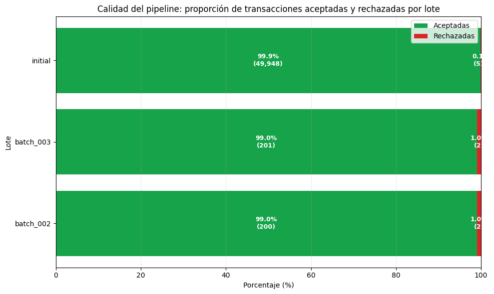

**Respuesta:** 
Resumen por lote:
- *batch_002*: 200 aceptadas / 2 rechazadas (total 202, 99.0% aceptadas).
- *batch_003*: 201 aceptadas / 2 rechazadas (total 203, 99.0% aceptadas).
- *initial*: 49,948 aceptadas / 51 rechazadas (total 49,999, 99.9% aceptadas).

**Conclusión**: Todos los lotes presentan una calidad similar (diferencia de 0.9 puntos porcentuales), pero los tamaños son muy distintos: el más grande tiene 247.5x las transacciones del más chico. Con muestras tan diferentes, la tasa sola no alcanza para evaluar la calidad real.

## Respuestas a las 20 preguntas de análisis y comprensión, incluyendo las consultas utilizadas cuando corresponda.

### 1. ¿Cuántas filas físicas recibió cada lote en `bronze_transactions_incremental`? Escribí una consulta que muestre el resultado por `source_batch_id`.

```sql
SELECT 
    source_batch_id,
    COUNT(source_batch_id) AS `n_rows`
FROM `workspace`.`bigdata_emanuel_rb`.`bronze_transactions_incremental`
GROUP BY source_batch_id;
```
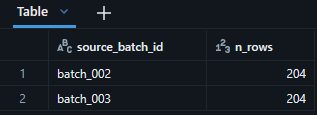

### 2. Para cada lote, ¿cuántas transacciones fueron aceptadas y cuántas quedaron en `silver_transactions_quarantine`? Reconciliá tus resultados con `gold_batch_summary`.

```sql
WITH accepted AS (
    SELECT source_batch_id, COUNT(*) AS trx_silver_accepted
    FROM workspace.bigdata_emanuel_rb.silver_transactions
    GROUP BY source_batch_id
),
quarantine AS (
    SELECT source_batch_id, COUNT(*) AS trx_silver_quarantine
    FROM workspace.bigdata_emanuel_rb.silver_transactions_quarantine
    GROUP BY source_batch_id
)
SELECT
    g.source_batch_id,
    a.trx_silver_accepted,
    g.accepted_transactions AS trx_gold_accepted,
    a.trx_silver_accepted = trx_gold_accepted AS accepted_ok,
    q.trx_silver_quarantine,
    g.rejected_transactions AS trx_gold_rejected,
    q.trx_silver_quarantine = trx_gold_rejected AS rejected_ok
FROM workspace.bigdata_emanuel_rb.gold_batch_summary g
LEFT JOIN accepted a USING (source_batch_id)
LEFT JOIN quarantine q USING (source_batch_id)
ORDER BY g.source_batch_id;
```

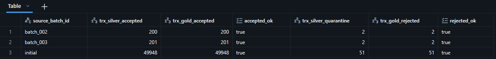

### 3. ¿Qué motivos de rechazo aparecen en la cuarentena y cuántos registros tiene cada uno por lote? ¿Los rechazos observados coinciden con los casos introducidos por el generador?

```sql
SELECT 
    source_batch_id,
    quality_reason AS `motivo_rechazo`,
    COUNT(*) AS `n_rechazos` 
FROM workspace.bigdata_emanuel_rb.silver_transactions_quarantine
GROUP BY source_batch_id, quality_reason
ORDER BY source_batch_id;
```

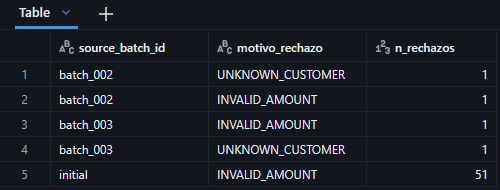

### 4. Seguí la transacción 42 desde `bronze_transactions_all` hasta `silver_transactions`. ¿Cuántas versiones existen en Bronze y cuál quedó vigente en Silver? Mostrá las columnas que justifican la elección.

```sql
WITH bronze AS (
    SELECT transaction_id, event_ts, updated_at
    FROM workspace.bigdata_emanuel_rb.bronze_transactions_all
    WHERE transaction_id = 42
),
silver AS (
    SELECT transaction_id, updated_at AS silver_updated_at
    FROM workspace.bigdata_emanuel_rb.silver_transactions
    WHERE transaction_id = 42
)
SELECT
    b.event_ts,
    b.updated_at AS bronze_updated_at,
    s.silver_updated_at,
    b.updated_at = s.silver_updated_at AS vigente_en_silver,
    COUNT(*) OVER () AS n_versiones_en_bronze
FROM bronze b
LEFT JOIN silver s
    ON b.transaction_id = s.transaction_id
ORDER BY b.updated_at DESC;
```

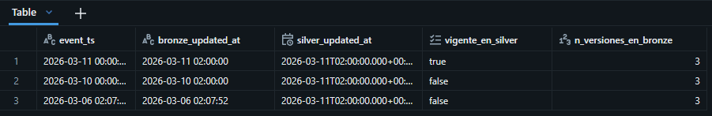

> Para la transacción `42` existen 3 versiones en `bronze_transactions_all` y una en `silver_transactions`. La elección de cual llega a silver se basa en la columna `updated_at`, la versión más actualizada se carga.

### 5. Comprobá mediante una consulta que `silver_transactions` tiene una sola fila por `transaction_id`. ¿Qué resultado indicaría que la deduplicación falló?

```sql
SELECT
    COUNT(*) AS filas,
    COUNT(DISTINCT transaction_id) AS transaction_ids,
    COUNT(*) = COUNT(DISTINCT transaction_id) AS una_fila_por_id
FROM workspace.bigdata_emanuel_rb.silver_transactions;
```

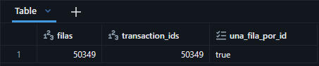

> Si valor de la columna `una_fila_por_id` es `False`, significa que la deduplicación falló.

### 6. Calculá la tasa de rechazo de cada lote como rechazadas / (aceptadas + rechazadas) en `gold_batch_summary`. ¿Es correcto comparar solamente las cantidades absolutas si los lotes tienen tamaños diferentes?

```sql
SELECT
    source_batch_id,
    accepted_transactions,
    rejected_transactions,
    accepted_transactions + rejected_transactions AS total,
    rejected_transactions / (accepted_transactions + rejected_transactions) AS tasa_rechazo
FROM workspace.bigdata_emanuel_rb.gold_batch_summary
ORDER BY source_batch_id;
```

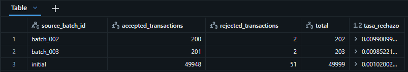

> Comparar solo las cantidades absolutas no es correcto cuando los lotes tienen tamaños distintos porque no demuestra que porción de las transacciones totales, son rechazadas por lote. La comparación que corresponde es la tasa de rechazo.


### 7. ¿Qué día presenta el mayor monto total y cuál presenta la mayor cantidad de transacciones? Consultá `gold_daily_sales` y explicá si ambos máximos coinciden.

```sql
WITH fecha_max_monto AS (
    SELECT
        sale_date,
        SUM(total_amount) AS monto
    FROM workspace.bigdata_emanuel_rb.gold_daily_sales
    GROUP BY sale_date
    HAVING SUM(total_amount) = (
        SELECT MAX(monto)
        FROM (
            SELECT SUM(total_amount) AS monto
            FROM workspace.bigdata_emanuel_rb.gold_daily_sales
            GROUP BY sale_date
        )
    )
),
fecha_max_transacciones AS (
    SELECT
        sale_date,
        SUM(transaction_count) AS transacciones
    FROM workspace.bigdata_emanuel_rb.gold_daily_sales
    GROUP BY sale_date
    HAVING SUM(transaction_count) = (
        SELECT MAX(transacciones)
        FROM (
            SELECT SUM(transaction_count) AS transacciones
            FROM workspace.bigdata_emanuel_rb.gold_daily_sales
            GROUP BY sale_date
        )
    )
)
SELECT
    m.sale_date AS fecha_max_monto,
    t.sale_date AS fecha_max_transacciones,
    m.sale_date = t.sale_date AS coinciden
FROM fecha_max_monto m
CROSS JOIN fecha_max_transacciones t;
```

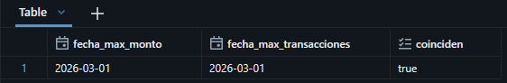

### 8. ¿Qué canal de pago tiene la mayor tasa global de fraude? Calculala como `SUM(fraud_transactions) / SUM(transaction_count)` y explicá por qué no corresponde promediar directamente `fraud_rate`.

```sql
SELECT
    payment_channel,
    SUM(fraud_transactions) / SUM(transaction_count) AS tasa_global_fraude
FROM workspace.bigdata_emanuel_rb.gold_daily_sales
GROUP BY payment_channel
ORDER BY tasa_global_fraude DESC;
```

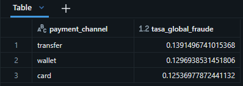

> El medio de pago `transfer` es la que mayor tasa de fraude tiene.
> 
> Además, no corresponde promediar directamente `fraud_rate` porque esa columna es la tasa de una fila, definida por día, país, categoría y canal. El promedio le da el mismo peso a cada fila.

### 9. ¿Qué combinación de país y categoría concentra el mayor monto vendido? Mostrá también la combinación líder dentro de cada país.

```sql
WITH por_pais_categoria AS (
    SELECT
        country,
        category,
        SUM(total_amount) AS monto
    FROM workspace.bigdata_emanuel_rb.gold_daily_sales
    GROUP BY country, category
),
ranking AS (
    SELECT
        country,
        category,
        monto,
        ROW_NUMBER() OVER (PARTITION BY country ORDER BY monto DESC) AS puesto_en_el_pais,
        ROW_NUMBER() OVER (ORDER BY monto DESC) AS puesto_global
    FROM por_pais_categoria
)
SELECT
    country,
    category,
    monto
FROM ranking
WHERE puesto_en_el_pais = 1
ORDER BY monto DESC;
```

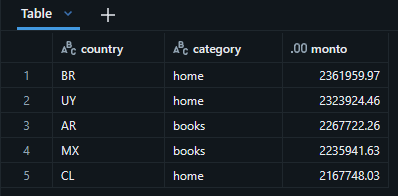

> La combinación `Brazil` y la categoría `Home`, es la que tiene mayor monto vendido

### 10. Compará las dos primeras filas de `pipeline_run_audit` correspondientes a la reejecución de `batch_002`. ¿Qué métricas permanecen iguales y qué columna demuestra que se realizó la comparación de idempotencia?

```sql
SELECT *
FROM workspace.bigdata_emanuel_rb.pipeline_run_audit
WHERE expected_batch_id = 'batch_002'
ORDER BY recorded_at DESC
LIMIT 2;
```

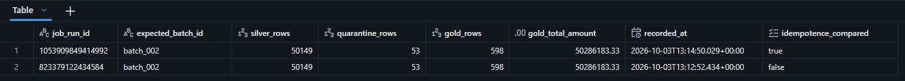

> **Métricas que permanecen iguales**: `silver_rows`, `quarantine_rows`, `gold_rows` y `gold_total_amount`.
>
> *Nota*: `job_run_id` y `recoreded_at` cambian porque es otra corrida (otro job_id y otro momento de corrida).
>
> **Columnas que demuestran que se realizó la compoaración de idempotencia**: `idempotence_compared`. Vale `False` en la primera corrida de batch_002 y `True` en la reejecución.

### 11. En `01_ingest_bronze_incremental.ipynb`, ¿qué problema resuelve `COPY INTO` y qué información utiliza para evitar cargar dos veces el mismo archivo físico?

`COPY INTO` evita la carga repetida los mismos archivos físicos. Recuerda la ruta de cada `.csv` ya ingerido en `bronze_transactions_incremental` y, en la corrida siguiente, solo lee los archivos de `{config.volume_path}/incoming/transactions/` cuya ruta todavía no está en ese registro. No compara el contenido. Si el archivo se renombra, la ruta nueva cuenta como otro archivo y las filas se insertan otra vez.

### 12. ¿Por qué la vista `bronze_transactions_all` usa `UNION ALL` en lugar de eliminar duplicados? ¿En qué capa se resuelven los duplicados de negocio y por qué?

La vista `bronze_transactions_all` almacena toda la historia de lo que llegó. Usa `UNION ALL` para apilar el lote initial y los `.csv` incrementales sin perder filas, así conserva todas las versiones de la misma transacción. Deduplicar ahí perdería ese historial.

La deduplicación de negocio se hace en Silver, no en Bronze. Silver elige la versión vigente: una fila por `transaction_id`, la de `updated_at` más nuevo.

### 13. ¿Por qué las transacciones iniciales reciben `source_batch_id='initial'` y usan `event_ts` como `updated_at`? ¿Cómo afecta eso a la corrección de la transacción 42?

Porque el lote inicial no trae estos campos. La vista se las agrega para que esas filas tengan las mismas columnas que los CSV incrementales y puedan ir en el `UNION ALL`.

`source_batch_id = 'initial'` les pone un lote. Sin eso, las filas históricas no se podrían agrupar ni distinguir de `batch_002` o `batch_003`.

`updated_at = event_ts` usa la única fecha que ese lote tiene: el momento de la transacción. No usa la fecha de carga. Así la versión inicial queda en el pasado respecto de una corrección posterior.

En la transacción `42`, la fila initial queda con `updated_at` 2026-03-06. La corrección de `batch_002` llega con `updated_at` 2026-03-10 y la de `batch_003` con 2026-03-11. El `MERGE` de Silver reemplaza la fila solo cuando el `updated_at` entrante es mayor, así que la corrección pisa a la original. Si `updated_at` del lote inicial fuera la fecha de carga, esa fila podría quedar más nueva que la corrección y Silver la ignoraría.

### 14. En `quality_rules.py`, ¿qué ventaja ofrece `try_cast` frente a un `cast` convencional cuando llega un importe como `N/A`?

`try_cast` intenta realizar el casteo, si no se puede, devuelve `null`. Esto permite que la ejecución del programa continúe.

Un `cast` convencional, de no poder llevar el dato al tipo destino, tira error y detiene toda la ejecución del programa.

Ante la llegada de un importe como `N/A`, `try_cast(amount AS DECIMAL(12,2))` intenta convertir el importe. Si el valor es `N/A` y no entra en ese tipo, deja `amount_typed` en `null` y la fila sigue. Un cast convencional, ante el mismo `N/A`, lanza un error y detiene la consulta.

### 15. Las reglas de calidad asignan una única `quality_reason`. ¿Qué sucede si un registro viola más de una regla y por qué importa el orden de las condiciones?

`add_quality_reason` arma `quality_reason` con una cadena de `when`. Cada `when` solo se evalúa si los anteriores fueron falsos, y el primero que es verdadero fija el valor. Los demás no se guardan. Si ninguno se cumple, la columna queda `null` y el registro se considera válido.

Si una fila viola varias reglas, queda una sola causa: la primera de la lista que da `True`.

1. INVALID_TRANSACTION_ID
2. INVALID_CUSTOMER_ID
3. INVALID_PRODUCT_ID
4. INVALID_EVENT_TS
5. INVALID_AMOUNT
6. INVALID_PAYMENT_CHANNEL
7. INVALID_FRAUD_FLAG
8. INVALID_UPDATED_AT
9. UNKNOWN_CUSTOMER
10. UNKNOWN_PRODUCT

El orden es la prioridad. Una fila con importe `N/A` y cliente desconocido queda como `INVALID_AMOUNT`, porque esa condición está antes que `UNKNOWN_CUSTOMER`. Al corregir el importe y volver a correr, la misma fila puede pasar a `UNKNOWN_CUSTOMER`. Cambiar el orden cambia la causa que se ve, aunque los defectos sean los mismos.

### 16. Explicá cómo se construye `_record_key` y cómo se usa junto con `row_number`. ¿Qué caso cubre el hash cuando `transaction_id` no puede convertirse a un número?

`_record_key` se construye apartir de un `coalesce` entre dos opciones:

1. Si `transaction_id` pudo pasarse a número, la clave es ese número en tipo texto.

2. Si no se puede convertir, `transaction_id_typed` queda `null` y entra la otra opción del coalesce: un `sha2` de 256 bits. `concat_ws("||", …)` junta las columnas crudas en un solo texto. Cada `null` se escribe como `"<NULL>"`, porque `concat_ws` se saltea los `null` y dos filas distintas podrían terminar con el mismo texto. El hash de ese texto es la clave.

Después `row_number` numera adentro de cada `_record_key`. Ordena por `updated_at_typed` de mayor a menor y, si empatan, ordena por `source_batch_id` también de mayor a menor. Con `where _rn = 1` se queda una sola fila por clave: la más nueva.

El hash cubre las filas que no tienen un `transaction_id` numérico. Si la clave fuera directamente `null`, todas esas filas caerían juntas y `row_number` se quedaría con una sola. Con el hash, cada contenido distinto tiene su propia clave y no se pierde mezclado con las demás.

### 17. Interpretá las dos cláusulas principales del `MERGE` de `silver_transactions`. ¿Cuándo se actualiza una fila existente y cuándo se inserta una nueva?

El `MERGE` compara por `transaction_id`. `WHEN MATCHED AND s.updated_at > t.updated_at THEN UPDATE SET *` actualiza la fila que ya existe solo si la versión entrante tiene un `updated_at` mayor. `WHEN NOT MATCHED THEN INSERT *` inserta la fila cuando ese `transaction_id` no está en Silver. Si el id existe y el `updated_at` entrante no es mayor, ninguna cláusula aplica y la fila queda como está.

### 18. ¿Por qué las tablas Gold se reconstruyen completamente en esta práctica mientras Silver se actualiza con `MERGE`? Mencioná una ventaja y una limitación de cada estrategia.

Gold se reconstruye completo porque cada tabla sale de un `CREATE OR REPLACE TABLE ... AS SELECT` sobre Silver. La ventaja es que el resultado se recalcula entero y una corrida nueva no acumula filas viejas. La limitación es que reescribe toda la tabla en cada corrida, aunque haya cambiado un solo lote.

Silver usa `MERGE` porque tiene que conservar la versión vigente de cada `transaction_id` y aplicar solo la corrección más nueva. La ventaja es que actualiza o inserta por clave, sin duplicar la transacción. La limitación es que no rehace las filas ya guardadas: si el `updated_at` entrante no es mayor, esa fila no se toca.

### 19. ¿Por qué `expected_batch_id` no participa en la detección del archivo nuevo? Indicá qué parte del pipeline descubre `batch_003` y qué parte utiliza el parámetro.

`expected_batch_id` no elige qué archivo leer. `batch_003` lo descubre la ingesta: `COPY INTO` recorre el directorio `incoming/transactions/` y carga las rutas que todavía no registró. El parámetro lo usa `validate`: dice qué lote hay que comprobar en esa corrida. En la ingesta también se lee, pero solo para un `assert` posterior a la copia. Si el archivo ya está y el parámetro sigue en `batch_002`, el archivo nuevo igual entra. `validate` puede fallar porque sigue evaluando `batch_002`.

### 20. Si la tarea `build_silver` falla, ¿qué ocurre con `build_gold` y `validate` en el Job? Explicá cómo las dependencias del DAG evitan publicar o validar resultados incompletos.

Si `build_silver` falla, `build_gold` no corre: depende de `build_silver`. `validate` tampoco corre: depende de `build_gold`. El Job las marca como omitidas. Esas dependencias evitan publicar Gold calculado con una Silver a medias y evitan validar un resultado que no se terminó de construir.

